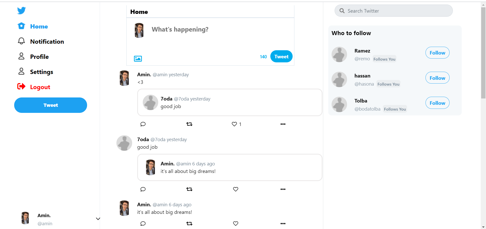
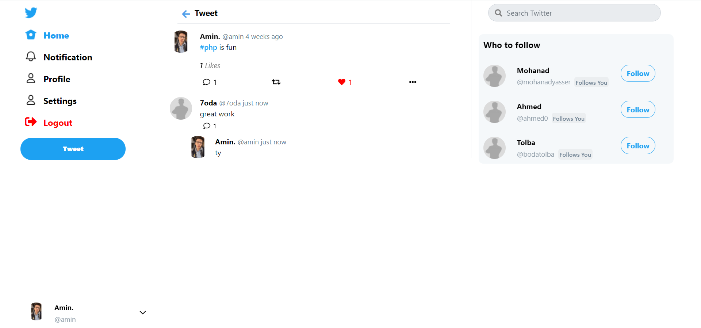
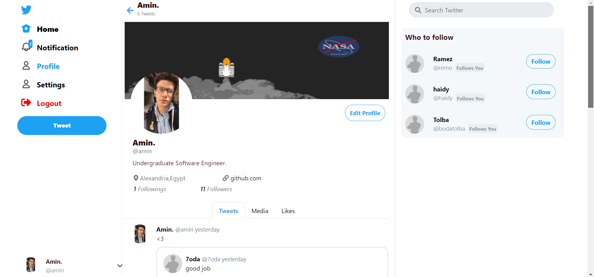
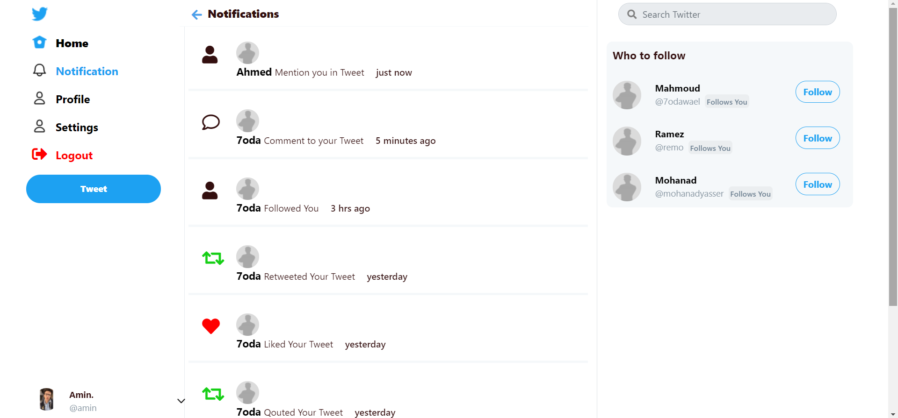
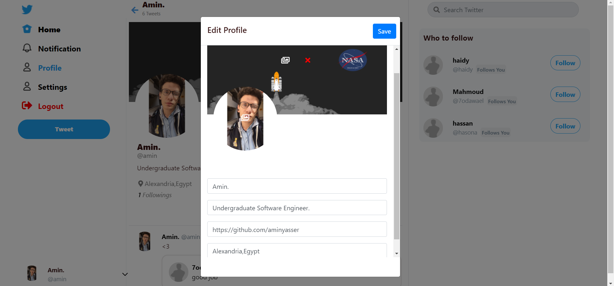
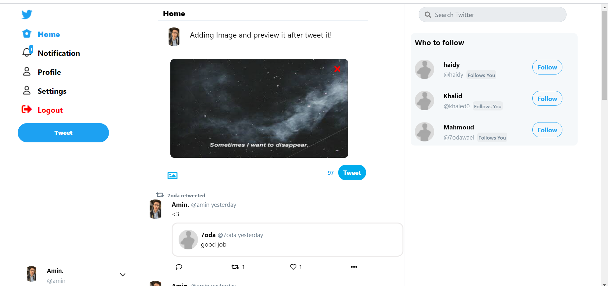
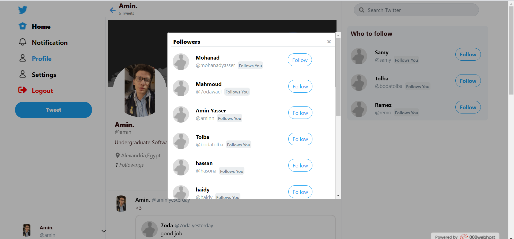
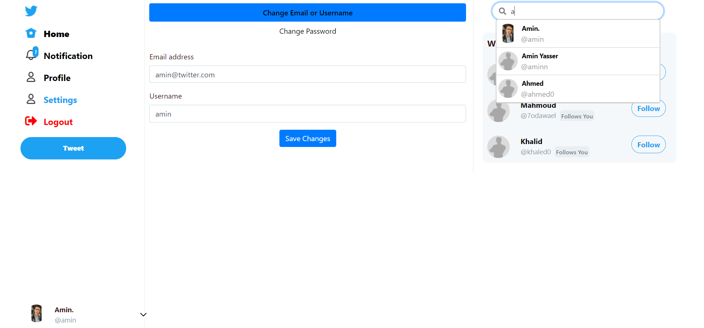

# Twitter-Clone
Twitter Clone using PHP In OOP style,MYSQL,AJAX,Jquery. 
for less talking Check out the deployed website  [Click Here](https://twtr-clone.000webhostapp.com/)

## Features

- Sign in / Sign UP
- Post Image or Normal Tweet.
- Retweet or Qoute Tweet (You can qoute the qouted tweet).
- Like Tweet.
- Add Comment and reply to the comment (Nested Comments).
- Mention User in Tweet or add hashtag to your tweet.
- Follow/Unfollow user.
- Get Notification when any previous action happened.
- Change Username/Password/Email From Settings.
- Search users by name and username.
- Edit Profile Like: (Change :avatar/username/cover etc).

## Running locally
 
 Make New Database with name "twitter" then import twitter.sql file in it.
 then the project is ready to run in localhost!

## UI

### Index

### Home

### Tweet and Comments

### Profile

### Notifications

### Edit Account

### Preview Image before Tweet

### Users List (For following/likedby etc)

### Setting
 

